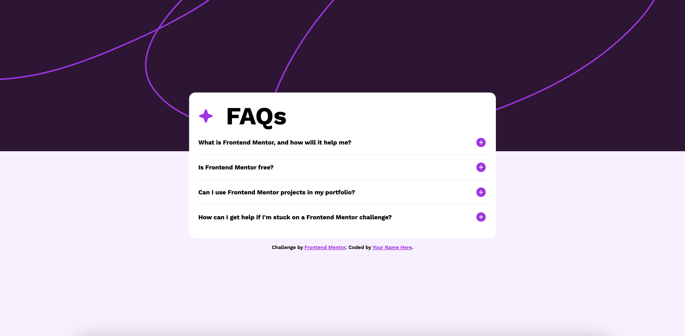

# Frontend Mentor - FAQ accordion solution

Frontend Mentor challenges help you improve your coding skills by building realistic projects. 

### Screenshot

### Links

- Live Site URL: https://denis-faq-accordion.netlify.app/

### What I learned

I developed an FAQ accordion using HTML, CSS, and JavaScript in this project. This accordion allows users to click on a question to reveal or hide the answer next to it. Additionally, I ensured that the layout adjusts appropriately based on the screen size, allowing users to access it comfortably on any device. I also implemented hover and focus states for all interactive elements on the page, improving the user experience.

While working on this project, I gained an understanding of the interactions between HTML, CSS, and JavaScript, and learned the fundamentals of building web applications using these languages. Furthermore, I acquired experience in improving user experience through responsive design and the use of interactive elements.

## Author

- Frontend Mentor - [@denisbayraktar](https://www.frontendmentor.io/profile/denisbayraktar)
- LinkedIn - [@denisbayraktar](https://www.linkedin.com/in/denisbayraktar/)
